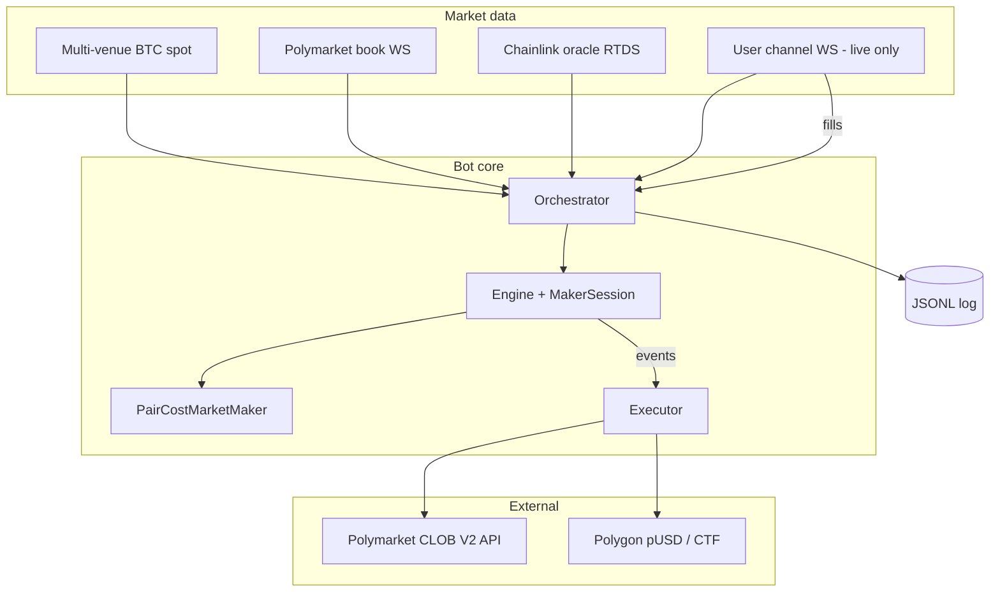

# BTC 5m Polymarket Maker Bot

[](https://github.com/BlindingHoolio/btc-5m-market-trading-bot)

Automated **market-making** bot for Polymarket **Bitcoin Up/Down 5-minute** markets. Built in **TypeScript** (Node.js ≥ 20). Posts resting buy orders on both outcomes, keeps inventory balanced, and targets a combined **pair cost below $1** so matched pairs profit at resolution.

**Repository:** [github.com/BlindingHoolio/btc-5m-market-trading-bot](https://github.com/BlindingHoolio/btc-5m-market-trading-bot)

| | |
|---|---|
| **Version** | 0.3.0 |
| **Language** | TypeScript (active); legacy Rust sources remain in `src/*.rs` |
| **Chain** | Polygon (**pUSD** — Polymarket USD, CLOB V2) |
| **Exchange** | Polymarket CLOB V2 (`@polymarket/clob-client-v2`) |
| **Default strategy** | `target_clone` (stable pair-cost maker) |

---

## Quick start

```bash
git clone https://github.com/BlindingHoolio/btc-5m-market-trading-bot.git
cd btc-5m-market-trading-bot
npm install
npm run build
npm test

# Paper run — no wallet key required
npm run paper

# After funding Polymarket (pUSD) and configuring .env:
cp .env.example .env   # set POLYMARKET_PRIVATE_KEY, POLY_FUNDER, POLY_SIGNATURE_TYPE=3 for new accounts
npm run preflight
npm run live           # 15 min supervised session, small caps
```

**Windows (first live run):** `.\live-start.ps1` — build → preflight → live with conservative caps.

> Paper first, then live with tiny caps. This bot is **not** guaranteed profit — see [Risk disclaimer](#risk-disclaimer).

---

## Who is this for?

- Traders who understand prediction markets and want **automated maker** execution on BTC 5m windows
- Developers comfortable running a **Node.js CLI** on a VPS or local machine
- Users willing to **paper-test first**, then scale live with small caps

You are responsible for capital, compliance, and configuration.

---

## How it works

Every 5 minutes, Polymarket opens a new market: *“Will BTC be up or down vs the window open?”*

- **UP token** pays **$1** if BTC finishes above the strike, **$0** otherwise
- **DOWN token** pays **$1** if BTC finishes below, **$0** otherwise

The bot tries to buy **both** tokens cheaply:

```
Example (simplified)
  Buy 10 UP   @ $0.47  = $4.70
  Buy 10 DOWN @ $0.50  = $5.00
  Pair cost = $0.47 + $0.50 = $0.97 per matched pair

  At resolution, one side pays $1 per share:
  Payout = 10 × $1 = $10.00
  Cost   = $9.70
  Gross profit ≈ $0.30 (before fees)
```

Profit depends on **maker fills** (resting bids getting hit). **Taker** crosses (urgent hedges) pay fees and should be rare.

---

## Table of contents

1. [Key concepts](#key-concepts)
2. [Strategy behaviour](#strategy-behaviour)
3. [Strategy presets](#strategy-presets)
4. [Risk & safety](#risk--safety)
5. [Architecture](#architecture)
6. [Data feeds](#data-feeds)
7. [Order execution](#order-execution)
8. [Requirements](#requirements)
9. [Installation](#installation)
10. [CLOB V2 & pUSD](#clob-v2--pusd)
11. [Configuration](#configuration)
12. [Getting started (step by step)](#getting-started-step-by-step)
13. [Paper vs live trading](#paper-vs-live-trading)
14. [CLI reference](#cli-reference)
15. [Logs & monitoring](#logs--monitoring)
16. [Settling & on-chain ops](#settling--on-chain-ops)
17. [Backtesting](#backtesting)
18. [Production deployment (PM2)](#production-deployment-pm2)
19. [Project structure](#project-structure)
20. [Development](#development)
21. [Troubleshooting & FAQ](#troubleshooting--faq)
22. [Known limitations](#known-limitations)
23. [Risk disclaimer](#risk-disclaimer)

---

## Key concepts

| Term | Meaning |
|------|---------|
| **Pair cost** | Average UP price + average DOWN price (when both sides held). Must stay **< $1.00** for matched pairs to be profitable. |
| **Maker** | Resting limit bid on the book. Low or zero fees; this is where edge comes from. |
| **Taker** | Immediate cross of the ask. Used only when the strategy needs an **urgent hedge**. Incurs taker fees (~7.2% curve on crypto markets). |
| **Clip** | Order size in shares per decision (preset-controlled, typically ~20 shares). |
| **Imbalance** | How far inventory deviates from 50/50 UP/DOWN. Bot prefers the lighter side. |
| **GTD** | Good-til-date order — resting bid with expiration (aligned to the 5m window). |
| **FOK** | Fill-or-kill — taker order that must fill immediately or cancel. |
| **Paper mode** | Simulates fills from the public book. No real money. |
| **Live mode** | Sends real orders; fills confirmed via Polymarket **user WebSocket**. |

---

## Strategy behaviour

Core logic lives in `PairCostMarketMaker` (`src/strategy.ts`) and `MakerSession` (`src/live-maker.ts`).

### What the bot does each tick

1. **Read the book** — UP/DOWN best bid/ask from Polymarket WebSocket
2. **Read BTC** — spot price from Binance (and fallback venues) for momentum / fair-value hints
3. **Choose a side** — usually the under-weighted leg; respects pair-cost and imbalance limits
4. **Price the bid** — below the ask, respecting spread and preset ceilings
5. **Post or cancel** — resting GTD bid for ~15s (`--maker-life-sec`), or cancel on expiry / adverse BTC move
6. **Hedge if needed** — if inventory is one-sided too long or pair cost is hot, may **taker cross** (live: real FOK order)
7. **Resolve** — at window end, compute PnL; cancel all resting orders

### Decision gates (high level)

- **Pair cost limits** — won't add size if projected pair cost exceeds preset max (e.g. 0.98–0.99)
- **Imbalance limits** — blocks adding to the heavy side when ratio exceeds threshold
- **Time gates** — `startDelaySec` after open; `stopBeforeEndSec` before close
- **Repair mode** — when pair cost is elevated, only fills that *improve* pair cost are allowed
- **Late window** — last ~90s may restrict to repair-only behaviour
- **Fair-value gate** — optional (`target_clone_v2` preset); uses BTC oracle + vol model in `src/live/fair.ts`

### What makes it profitable (in theory)

- Mostly **maker** fills at favorable prices
- **Both legs** opened with combined cost < $1
- **Low taker usage** — fees quickly erase the thin margin
- **Risk halts** — stops trading bad sessions before large drawdown

---

## Strategy presets

Selected via engine config (CLI flags). Live default: **`target_clone`**.

| Preset | CLI flag | Use case |
|--------|----------|----------|
| **`target_clone`** | *(default)* | Live/paper `run` — balanced clone of stable maker, ~20 share clips |
| **`passive_budget`** | `--passive-budget` | Tighter budget on bid prices; caps naked leg USD |
| **`stable_live`** | `--stable-live` (backtest) | Locked production preset (`stable_live_v2_fill1s_20260531`) |
| **`target_clone_v2`** | code only | Adds fair-value gate + lead-high-prob open |
| **`target_clone_active`** | code only | Active cross on tight spreads (more taker-like) |

Backtest `--mode trader` also defaults to `target_clone`. Use `--stable-live` to replay the locked historical preset.

---

## Risk & safety

Multiple independent layers protect capital:

### Executor caps (always on in live)

| Control | Env / flag | Purpose |
|---------|------------|---------|
| Per-order USD cap | `MAX_ORDER_USD` / `--order-usd` | Max notional per single order |
| Order count cap | `MAX_ORDERS` / `--max-orders` | Kill-switch after N submissions |
| Total USD cap | `MAX_TOTAL_USD` / `--max-total-usd` | Cumulative notional limit (defaults **$10** on live if unset) |
| Min order size | 5 shares (built-in) | Polymarket minimum |
| Geographic API check | startup | Applies the official API rules; IE/JP/NL frontend-only restrictions do not falsely block the API |
| Startup `cancelAll` | live only | Clears stale resting orders |

### Strategy risk engine (`src/risk.ts`)

| Control | Typical behaviour |
|---------|-------------------|
| **Daily soft loss** | Switches to cautious mode (tighter limits) |
| **Daily hard loss** | Halts all trading for the UTC day |
| **Market soft loss** | Cautious mode within one 5m window |
| **Market max loss** | Halts trading in that market |
| **Max unhedged time** | Halts if one-sided too long (non-stable paths) |
| **Pair cost emergency** | Repair-only or halt when pair cost too high |
| **Consecutive losses** | Optional clip reduction / halt |

When daily halt triggers, the orchestrator **stops the run loop** and cancels orders.

---

## Architecture



### Lifecycle of one 5-minute market

```
T+0s     Discovery finds btc-updown-5m-{timestamp}
         Feeds connect (BTC, PM book, oracle, user WS if live)
T+4–6s   Strategy starts quoting (startDelaySec)
         …      Resting bids posted / cancelled / filled
T+240s   stopBeforeEndSec — stop new quotes (~60s before end in research preset;
         ~10s before end in stable/target_clone)
T+300s   Window closes — winner from oracle (or book proxy)
         PnL logged, all orders cancelled, next market discovered
```

---

## Data feeds

| Feed | Source | Purpose |
|------|--------|---------|
| **BTC spot** | Binance spot/perp, Coinbase, OKX, Bybit | Momentum, defensive cancel, fair-value proxy |
| **Polymarket book** | `wss://ws-subscriptions-clob.polymarket.com/ws/market` | UP/DOWN bids/asks; drives strategy |
| **Chainlink oracle** | RTDS `wss://ws-live-data.polymarket.com` | Strike/resolution reference (disable: `--no-oracle`) |
| **User channel** | `wss://ws-subscriptions-clob.polymarket.com/ws/user` | **Live only** — authenticated fills & cancels |
| **REST book poll** | CLOB `/prices` | Optional backstop (`--book-poll-hz`) |

Debug feeds without trading:

```bash
node dist/cli/live.js feeds-dump --seconds 30
```

Optional verbose feed logging (set in `.env`):

```env
BTC_TRACE=1
PM_TRACE=1
RTDS_TRACE=1
```

---

## Order execution

| Mode | Maker orders | Taker hedges | Fill source |
|------|--------------|--------------|-------------|
| **Paper** | Logged as `PAPER GTD BUY` | Simulated instantly | Book: ask ≤ your bid |
| **Live** | Post-only **GTD** via CLOB | **FOK** market buy | User WebSocket (`exchange_fill`) |

Live startup sequence:

1. **Wallet preflight** (auto on `--live`; skip with `--skip-preflight`) — pUSD / CLOB balance, allowances
2. Geoblock API check
3. Connect CLOB — `updateBalanceAllowance` (sync pUSD to ledger), **heartbeat** keepalive
4. `cancelAll()` on any leftover orders
5. Derive CLOB API key (L1 wallet auth → L2 HMAC)
6. Subscribe user WebSocket with API credentials
7. Skip markets with **<90s** remaining (need time for GTD quotes)
8. Trade until halt or duration limit

---

## Requirements

| Requirement | Notes |
|-------------|-------|
| **Node.js ≥ 20.10** | Required by `@polymarket/clob-client-v2` |
| **npm** | Install dependencies; on Windows use `npm.cmd` if PowerShell blocks scripts |
| **Polymarket account** | **pUSD** on Polygon (deposit via [polymarket.com](https://polymarket.com) or `wrap`) |
| **Deposit wallet (new accounts)** | Post–Apr 2026 accounts need **signature type 3** — see [Wallet setup](#wallet-setup-clob-v2) |
| **Allowed region / IP** | VPN or datacenter IPs often fail at order time |
| **Dedicated wallet** | Fund only what you can lose |
| **Backtest data** | Optional ~30 GB snapshots in `../data/` — **not needed for live/paper** |

---

## Installation

```bash
git clone https://github.com/BlindingHoolio/btc-5m-market-trading-bot.git
cd btc-5m-market-trading-bot

npm install
npm run build
npm test
```

Create your local environment file:

```bash
cp .env.example .env
# Edit .env — never commit this file
```

### npm scripts

| Script | Command | Purpose |
|--------|---------|---------|
| `npm run build` | `tsc` | Compile TypeScript → `dist/` |
| `npm run preflight` | `node dist/cli/live.js preflight` | Read-only wallet / pUSD / CLOB balance check |
| `npm run paper` | `run --paper --duration-min 6` | 6-minute paper session → `results/paper/session.jsonl` |
| `npm run live` | `run --live --duration-min 15` | 15-minute live session → `results/live/session.jsonl` |
| `npm test` | `vitest run` | Unit tests (32 tests, 10 files) |
| `npm run typecheck` | `tsc --noEmit` | Type-check without emit |
| `npm run dev` | `tsx src/cli/live.ts` | Development entry (no build step) |
| `npm run setup:win` | PowerShell script | One-time Windows npm/npx fix |

**Windows — supervised first live run:**

```powershell
.\live-start.ps1
```

Runs build → preflight → live with conservative caps (**$2/order**, $10 total, 50 orders, 15 min). For manual runs, prefer **`--order-usd 2.5–3`** to satisfy Polymarket's 5-share minimum at typical prices.

---

## CLOB V2 & pUSD

Polymarket migrated to **CLOB V2** (live April 2026). Key changes for this bot:

| Topic | V1 (legacy) | V2 (current) |
|-------|-------------|--------------|
| Collateral | USDC.e | **pUSD** (Polymarket USD, ERC-20 on Polygon) |
| SDK | `@polymarket/clob-client` | **`@polymarket/clob-client-v2`** |
| CTF Exchange | `0x4bFb…982E` | **`0xE111…996B`** |
| New API accounts | Proxy (type 1) | **Deposit wallet (type 3 / POLY_1271)** |

- **UI users:** deposits on polymarket.com auto-wrap to pUSD.
- **API users:** may need `wrap` to convert USDC.e → pUSD via the Collateral Onramp.
- Docs: [pUSD](https://docs.polymarket.com/concepts/pusd) · [V2 migration](https://docs.polymarket.com/v2-migration) · [Deposit wallets](https://docs.polymarket.com/trading/deposit-wallets)

---

## Configuration

### Environment variables

| Variable | Required | Default | Description |
|----------|----------|---------|-------------|
| `POLYMARKET_PRIVATE_KEY` | Live | — | Signer private key (`0x…`) |
| `POLY_FUNDER` | No* | auto | Trading wallet — **required for new deposit-wallet accounts** (type 3) |
| `POLY_SIGNATURE_TYPE` | No* | auto | **New accounts: set `3`** (POLY_1271). Legacy: auto-detected 0/1/2 |
| `LIVE` | No | `false` | `true` enables live unless `--paper` is passed |
| `MAX_ORDER_USD` | No | `2` | Max USD per order — use **≥2.5–3** for live (5-share minimum) |
| `MAX_ORDERS` | No | `50` (.env) / `200` (CLI fallback) | Session order-count kill-switch |
| `MAX_TOTAL_USD` | No | `10` on live | Cumulative notional cap per session |
| `POLYGON_RPC` | No | publicnode | Polygon RPC for signing / reads |
| `CLOB_HOST` | No | `https://clob.polymarket.com` | CLOB V2 REST host |
| `HEARTBEAT_MS` | No | `50` | Strategy tick interval (ms) |
| `BTC_MOVE_BPS` | No | `0` | Re-evaluate when BTC moves ≥ N bps (`0` = every book update) |
| `BOOK_POLL_HZ` | No | `0` | REST book poll rate (`0` = off) |
| `DEFENSIVE_CANCEL_BPS` | No | `0` | Cancel quotes if BTC moves adversely |
| `MONITOR_WEBHOOK` | No | — | Slack/Discord webhook URL for `monitor` alerts |

\* New post–V2 accounts typically need explicit `POLY_FUNDER` + `POLY_SIGNATURE_TYPE=3`.

CLI flags override env vars when both are set.

### Wallet setup (CLOB V2)

**New accounts (browser wallet / MetaMask signup after Apr 2026):**

1. Deposit on [polymarket.com](https://polymarket.com) (auto-wraps to pUSD).
2. Place **one small manual trade** on the UI (deploys deposit wallet if needed).
3. Copy your **deposit address** from Settings → add to `.env`:

```env
POLYMARKET_PRIVATE_KEY=0x...
POLY_FUNDER=0xYourDepositWalletAddress
POLY_SIGNATURE_TYPE=3
LIVE=true
MAX_ORDER_USD=2.5
MAX_TOTAL_USD=10
```

4. Run `npm run preflight` — expect **CLOB tradable (pUSD) ≥ $2** and **READY**.

**Legacy accounts (Magic email, old proxy, Gnosis Safe):** auto-detection usually works with only `POLYMARKET_PRIVATE_KEY`. Override if needed:

```env
POLY_FUNDER=0xYourPolymarketTradingWallet
POLY_SIGNATURE_TYPE=1   # proxy — or 2 for Safe, 0 for plain EOA
```

### Wallet auto-detection

When `POLY_FUNDER` / `POLY_SIGNATURE_TYPE` are **not** set, the bot resolves:

1. **Funder** — Gamma API `/public-profile?address=<EOA>` → `proxyWallet` (or EOA if none).
2. **Signature type** — on-chain checks on the funder:
   - `0` **EOA** — funder equals signer
   - `2` **Gnosis Safe** — `getOwners()` succeeds
   - `3` **Deposit wallet (POLY_1271)** — ERC-1271 + `owner()` matches signer
   - `1` **Magic/proxy** — other contract wallets

> **Warning:** Auto-detection may pick type **1** for addresses that CLOB V2 rejects. If you see `maker address not allowed, please use the deposit wallet flow`, set **`POLY_SIGNATURE_TYPE=3`** and fund the **deposit wallet**, not the legacy proxy.

---

## Getting started (step by step)

### Step 1 — Paper run (no key needed)

Validate feeds and strategy on real market data without risk:

```bash
npm run build
npm run paper
# or: node dist/cli/live.js run --log-file results/paper/my-session.jsonl
```

Let it run through **at least one full 5-minute market**, then:

```bash
node dist/cli/live.js analyze results/paper/session.jsonl
```

Look for:

- Quotes on **both** UP and DOWN
- Reasonable fill rate in paper (optimistic upper bound)
- `resolved` events with pair cost < 1.0

### Step 2 — Wallet preflight

```bash
npm run preflight
```

Expect (CLOB V2 / pUSD):

| Check | Target |
|-------|--------|
| **CLOB tradable (pUSD)** | ≥ $2 (authoritative for order acceptance) |
| **pUSD on-chain** | Matches deposit wallet balance |
| **pUSD → Exchange allowance** | Approved (or proxy-managed) |
| **POL gas (EOA)** | ≥ 0.05 only for **EOA (type 0)** on-chain ops; optional for type 3 CLOB-only |

Live `run --live` runs preflight automatically (use `--skip-preflight` to bypass).

### Step 3 — Approvals & wrapping

**Deposit wallet / proxy users:** approvals are usually managed by Polymarket UI.

**EOA (type 0) — approve pUSD for CTF Exchange V2:**

```bash
node dist/cli/live.js approve          # dry-run
node dist/cli/live.js approve --broadcast
```

**API-only — wrap USDC.e → pUSD:**

```bash
node dist/cli/live.js wrap --amount-usd 10          # dry-run
node dist/cli/live.js wrap --amount-usd 10 --broadcast
```

### Step 4 — First live session (supervised, tiny size)

```bash
node dist/cli/live.js run --live \
  --order-usd 2.5 \
  --max-orders 50 \
  --max-total-usd 10 \
  --duration-min 15 \
  --log-file results/live/first-live.jsonl \
  --traded-file results/live/traded.jsonl
```

Or on Windows: `.\live-start.ps1` (uses $2/order — raise to 2.5–3 if hedges fail min-size checks).

**Watch simultaneously:**

- Terminal: `LIVE GTD BUY` and **`EXCHANGE FILL`** (authoritative live fills)
- Polymarket UI → open orders and positions

Use **≥ $2.50/order** so 5-share minimums fit at typical 0.40–0.50 prices. Raise to **$3** if taker hedges fail with “below min 5 shares”.

Only increase caps after fills match expectations.

### Step 5 — Redeem after resolution

```bash
node dist/cli/live.js settle --from-log results/live/traded.jsonl --broadcast
```

---

## Paper vs live trading

| | Paper | Live |
|---|-------|------|
| **Command** | `run` or `run --paper` | `run --live` |
| **Private key** | Not required | Required |
| **Orders sent** | No | Yes — real CLOB |
| **Fill detection** | Simulated from book | User WebSocket |
| **Taker hedges** | Instant simulation | FOK market orders |
| **PnL in log** | Modelled | Modelled from confirmed fills |
| **Capital at risk** | None | Yes |

> **Important:** Paper fill rates are an **optimistic ceiling**. Paper cannot model queue priority, partial fills, or latency. Always validate with a small live test.

---

## CLI reference

After `npm run build`:

| Binary | Alias |
|--------|-------|
| `node dist/cli/live.js` | `npx btc-5m-live` |
| `node dist/cli/backtest.js` | `npx btc-5m-backtest` |

### `run` — main trading loop

```bash
node dist/cli/live.js run [options]
```

| Option | Default | Description |
|--------|---------|-------------|
| `--live` | `LIVE` env | Enable real trading |
| `--paper` | — | Force paper (overrides `--live`) |
| `--skip-preflight` | — | Skip wallet preflight on live (not recommended) |
| `--order-usd <n>` | `MAX_ORDER_USD` / 2 | Max USD per order |
| `--max-orders <n>` | `MAX_ORDERS` / 200 | Order submission cap |
| `--max-total-usd <n>` | `MAX_TOTAL_USD` / 10 live | Total notional cap |
| `--heartbeat-ms <n>` | 50 | Loop heartbeat |
| `--btc-move-bps <n>` | 0 | BTC move throttle |
| `--book-poll-hz <n>` | 0 | REST book backstop |
| `--no-oracle` | — | Disable Chainlink feed |
| `--passive-budget` | — | Use passive_budget preset |
| `--defensive-cancel-bps <n>` | 0 | Adverse BTC cancel |
| `--maker-life-sec <n>` | 15 | Resting quote TTL |
| `--decision-interval-ms <n>` | 0 | Min gap between decisions |
| `--log-file <path>` | `paper_log.jsonl` | JSONL output |
| `--traded-file <path>` | `traded_conditions.jsonl` | Market IDs for settle |
| `--duration-min <n>` | 0 | Auto-stop after N minutes |

**Examples**

```bash
# Paper, passive preset, 30 min
node dist/cli/live.js run --passive-budget --duration-min 30 --log-file results/paper/passive.jsonl

# Live with defensive cancel on 30 bps BTC move
node dist/cli/live.js run --live --defensive-cancel-bps 30 --order-usd 3
```

### Other commands

| Command | Description |
|---------|-------------|
| `preflight [--address 0x…]` | Read-only pUSD / CLOB balance / allowance check (CLOB V2) |
| `approve [--broadcast]` | pUSD → CTF Exchange **V2** approval (EOA wallets) |
| `wrap [--amount-usd N] [--broadcast]` | USDC.e → pUSD via Collateral Onramp (API path) |
| `settle [--condition-id …] [--from-log …] [--broadcast]` | Redeem resolved tokens (pUSD collateral) |
| `analyze [logfile]` | Session summary: quotes, fills, PnL, verdict |
| `monitor [logfile]` | Live dashboard + optional webhook alerts |
| `feeds-dump [--seconds 20]` | Stream raw feed JSON (debug) |
| `maker-hedge` | Legacy alias → same as `run` (see [limitations](#known-limitations)) |

### `monitor` options

| Option | Default | Description |
|--------|---------|-------------|
| `--interval <n>` | 10 | Poll interval (seconds) |
| `--once` | — | Single pass, then exit |
| `--loss-floor <n>` | -25 | Alert when session PnL drops below this |
| `--stale-sec <n>` | 120 | Alert when log has no events for N seconds |

### Backtest CLI

```bash
node dist/cli/backtest.js [options]
```

| Option | Description |
|--------|-------------|
| `--mode trader` | Fast replay (default) |
| `--mode realistic` | Simulates resting order life / contingent fills |
| `--mode full` | Full snapshot replay |
| `--target-clone` | Use live-aligned preset |
| `--stable-live` | Locked historical preset |
| `--data-dir <path>` | Snapshot directory (default `../data`) |
| `--dates 2026-05-29,2026-05-30` | Restrict dates |
| `--maker-life-sec 15` | Resting TTL in realistic mode |

---

## Logs & monitoring

### JSONL journal format

Each line is one JSON object. Common `event` types:

| Event | When |
|-------|------|
| `reset` | New 5m market started |
| `quote` | Resting bid intended / submitted |
| `taker` | Urgent cross intended (live) |
| `fill` | Fill applied to inventory (paper or confirmed) |
| `exchange_fill` | Authoritative fill from user WS (live) |
| `cancel` | Resting quote cancelled |
| `exchange_cancel` | Cancel confirmed from user WS |
| `resolved` | Market ended — PnL, pair cost, winner |
| `error` | Engine / feed error |

Example `resolved` record fields: `pnl`, `pair_cost`, `up_shares`, `down_shares`, `fills`, `daily_halted`.

Logs are gitignored by default except `results/track/` (persisted CLOB recordings).

### Analyze a session

```bash
node dist/cli/live.js analyze results/live/session.jsonl
```

Reports quoting rate, fill rate, per-side breakdown, PnL, pair cost, and a **verdict** (viable / not viable / sit-out).

### Live monitor

```bash
node dist/cli/live.js monitor results/live/session.jsonl \
  --interval 10 \
  --loss-floor 25 \
  --stale-sec 120
```

Alerts (console + optional `MONITOR_WEBHOOK`) on:

- Engine errors
- Daily circuit breaker
- PnL below floor
- Stale log (no events for N seconds)

---

## Settling & on-chain ops

Polygon mainnet — [Polymarket contracts (V2)](https://docs.polymarket.com/resources/contracts):

| Contract | Address |
|----------|---------|
| **pUSD** (collateral) | `0xC011a7E12a19f7B1f670d46F03B03f3342E82DFB` |
| USDC.e (wrap source) | `0x2791Bca1f2de4661ED88A30C99A7a9449Aa84174` |
| Collateral Onramp | `0x93070a847efEf7F70739046A929D47a521F5B8ee` |
| CTF | `0x4D97DCd97eC945f40cF65F87097ACe5EA0476045` |
| **CTF Exchange V2** | `0xE111180000d2663C0091e4f400237545B87B996B` |
| Neg-risk Exchange V2 | `0xe2222d279d744050d28e00520010520000310F59` |

The bot trades via CLOB V2; tokens settle on-chain after resolution. Use `settle` to redeem winning positions (pUSD collateral). Legacy V1 exchange `0x4bFb…982E` is **not** used.

---

## Backtesting

Historical replay requires **external snapshot files** (not included in this repo, ~30 GB typical).

```bash
# Quick trader-mode replay
node dist/cli/backtest.js --target-clone --mode trader

# More realistic maker simulation
node dist/cli/backtest.js --target-clone --mode realistic --maker-life-sec 15 \
  --dates 2026-05-29,2026-05-30
```

| Mode | Fidelity | Speed |
|------|----------|-------|
| `trader` | Instant fill model aligned with live engine | Fast |
| `realistic` | Resting bids expire; fills when ask crosses bid | Slower |
| `full` | Full snapshot walk | Slowest |

**Live and paper trading never require backtest data.**

---

## Production deployment (PM2)

`ecosystem.config.js` defines two processes:

| Process | Script | Purpose |
|---------|--------|---------|
| `btc-recorder` | `run` (paper) | Feed + strategy logging → `results/track/recorder.jsonl` |
| `btc-live-a` | `pm2-live-a.sh` | Live trading with small caps |

Before deploying, edit `cwd` and log paths in `ecosystem.config.js` to match your server.

```bash
pm2 start ecosystem.config.js
pm2 logs btc-live-a --lines 100
pm2 restart btc-live-a
```

`pm2-live-a.sh` loads `.env`, rebuilds TypeScript, and runs live with **$2/order**, 50 orders, $10 total cap.

**Windows:** use `live-start.ps1` instead (PM2 script paths target Linux).

---

## Project structure

Active TypeScript sources (legacy Rust files in `src/*.rs` are not used by the Node.js build):

```
src/
├── strategy.ts           PairCostMarketMaker — side, price, sizing
├── config.ts             Presets: target_clone, stable_live, passive_budget, …
├── inventory.ts          Positions, pair cost, payout math
├── risk.ts               Daily/market circuit breakers, repair logic
├── models.ts             Side, Fill, Polymarket fee formula
├── live-maker.ts         MakerSession — quotes, live/paper fill paths
├── live/
│   ├── orchestrator.ts   Main event loop, market lifecycle
│   ├── engine.ts         Book validation + session wrapper
│   ├── executor.ts       Paper/live submit, caps, kill switches
│   ├── discovery.ts      Gamma API → active btc-updown-5m market
│   ├── orderbook.ts      In-memory bid/ask book
│   ├── fair.ts           Fair-value / normal-CDF helpers
│   ├── clob/
│   │   ├── client.ts     CLOB v2 + viem signer, balance sync, heartbeat
│   │   └── wallet.ts     Funder + signature type auto-detection
│   ├── contracts.ts      V2 contract addresses (pUSD, Exchange, Onramp)
│   ├── feeds/
│   │   ├── btc.ts        Multi-venue BTC WebSocket
│   │   ├── polymarket.ts Order book WebSocket
│   │   ├── user.ts       Authenticated fill feed (live)
│   │   ├── rtds.ts       Chainlink BTC/USD oracle
│   │   └── clob-poll.ts  REST book backstop
│   ├── onchain.ts        preflight, approve, wrap, settle (pUSD / V2)
│   ├── journal.ts        JSONL writer
│   └── analysis.ts       analyze + monitor
└── cli/
    ├── live.ts           btc-5m-live entry point
    └── backtest.ts       btc-5m-backtest entry point

scripts/
├── invoke-npm.ps1        Windows npm shim (used by live-start.ps1)
└── setup-windows.ps1     One-time PowerShell execution-policy fix

live-start.ps1            Windows supervised first-live launcher
pm2-live-a.sh               Linux PM2 live launcher
ecosystem.config.js       PM2 process definitions
```

---

## Development

```bash
npm run build      # Compile to dist/
npm test           # Vitest — 32 tests across 10 files
npm run typecheck  # tsc --noEmit
npm run dev        # tsx src/cli/live.ts (development)
```

Tests cover strategy, config, discovery, engine book gates, user WS parsing, contracts, wallet detection, and live-mode session behaviour.

---

## Troubleshooting & FAQ

### `npm` fails in PowerShell (`npm.ps1 cannot be loaded`)

On Windows, PowerShell may resolve `npm` to `npm.ps1`, which is blocked when script execution is restricted. Use any of these:

```powershell
# Option A — batch shim (always works)
npm.cmd install
npm.cmd run build

# Option B — one-time setup (allows npm/npx in PowerShell)
npm.cmd run setup:win

# Option C — project scripts already use scripts/invoke-npm.ps1
.\live-start.ps1
```

Cursor agents on Windows should use `npm.cmd`, not bare `npm`.

### `maker address not allowed, please use the deposit wallet flow`

Your account needs **deposit wallet (type 3)**, not legacy proxy (type 1):

```env
POLY_FUNDER=0xYourDepositWalletFromSettings
POLY_SIGNATURE_TYPE=3
```

Fund the **deposit wallet** on polymarket.com. pUSD in an old proxy wallet does not count for V2 API orders. Place one UI trade first if the wallet was never deployed.

### Orders rejected / 403 on live

- Check **geoblock** — terminal prints country at startup
- Avoid **VPN / datacenter IPs**; residential IP often required
- Verify `POLY_FUNDER` and `POLY_SIGNATURE_TYPE` match your account type

### `invalid post-only order: order crosses book`

Quote price was at or above the ask. The bot cancels and requotes — normal in fast markets.

### `preflight` shows CLOB $0 but pUSD on-chain > 0

Run live once (connect syncs balance) or refresh deposit on polymarket.com. Preflight calls `updateBalanceAllowance` when a private key is set.

### `preflight` shows zero allowance (EOA only)

```bash
node dist/cli/live.js approve --broadcast
```

### Bot quotes but no live fills

- Normal in thin markets — maker strategy waits for someone to hit your bid
- Compare **`EXCHANGE FILL`** in log vs Polymarket UI (not `fill` alone)
- Paper fill rate ≠ live fill rate

### Inventory seems wrong after restart

- Restart triggers `cancelAll` but does not reload exchange positions
- Check Polymarket UI; manually reconcile before restarting mid-market

### `daily_halted: true` in log

- Daily loss limit hit — bot stops intentionally
- Review `analyze` output; adjust preset or caps before next session

### Minimum order size / taker hedge skipped

- Polymarket requires **≥ 5 shares** per order
- At $2.50 cap, hedges fail when price × 5 > $2.50 (e.g. DOWN @ 0.65 → need ~$3.25)
- Raise `MAX_ORDER_USD` to **2.5–3** for live BTC 5m markets

### Backtest says no data

- Place snapshot JSON under `../data/` or pass `--data-dir`
- Not required for `run` / live trading

### Is this the same as the old Rust bot?

- Core strategy and live path are ported to TypeScript
- Legacy **`maker-hedge`** specialised loop is **not** fully ported — CLI uses `run` instead
- Rust sources remain in the repo for reference but are not part of the npm build

---

## Known limitations

| Item | Detail |
|------|--------|
| **`maker-hedge` CLI** | Delegates to `run`; full Rust hedge loop not ported |
| **Deposit wallet onboarding** | New V2 accounts need type 3 + relayer deploy; UI trade is fastest path |
| **Paper vs live gap** | Paper overstates fill rate and ignores queue position |
| **Mid-market restart** | No automatic exchange position sync |
| **Taker hedges** | Need sufficient `MAX_ORDER_USD` for 5-share minimum at high prices |
| **Post-only rejects** | Aggressive quotes that cross the book are rejected by CLOB |
| **Geoblock** | Preflight pass ≠ order acceptance |
| **Battle testing** | Validate with small live size before scaling |

---

## Risk disclaimer

This software is provided **as-is** for research and educational use.

- Prediction market trading carries **substantial risk of loss**
- Backtest results **do not guarantee** live performance
- Smart-contract, API, latency, and model risk apply
- Use a **dedicated wallet** with limited funds
- You are responsible for **legal compliance** and Polymarket Terms of Service
- Authors accept **no liability** for financial losses
